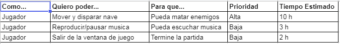
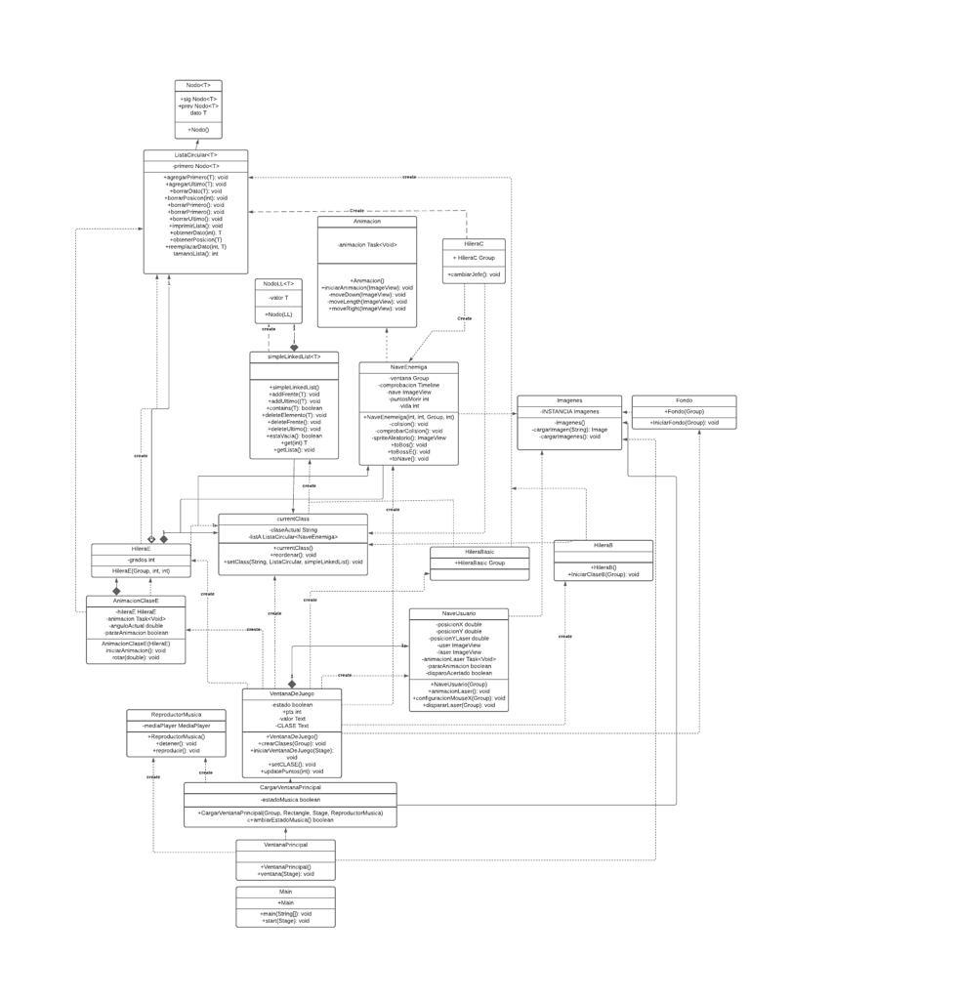

# Proyecto Programado 1 Space Invaders
## Desarrolladores:
- [Calderón Barboza Adriana María (2020036728)](https://github.com/cuadriante) 
- [Hidalgo Vargas Sebastián (2019176561)](https://github.com/Katharsis0)
- [Serrano Cañas Daniel (2019031631)](https://github.com/dansecan25) 
- [Zúñiga Barahona Daniel Andrés (2019043724)](https://github.com/danyazunigab)

## Jira
[Link a Jira](https://projprog1spaceinvaders.atlassian.net/jira/software/projects/SPAC/boards/1)

## Repositorio del Proyecto Programado (GitHub)
[Link al proyecto](https://github.com/dansecan25/Proyecto1-SpaceInvaders)

## Plan de Iteraciones
[Plan de iteraciones](https://projprog1spaceinvaders.atlassian.net/jira/software/projects/SPAC/boards/1/roadmap)
## User Story
 
## Asignación de Tareas
- Sebastián:
  - Diseños:
     -Imagen Boss colaboración con Adriana
     -Imagen Enemigos colaboración con Adriana
  - Lista Enlazada (Single)
  - Lista Doblemente Enlazada
  - Pantalla Game Over
  - Pantalla Ajustes
  - Clase Basic
  - Clase A
  
  
- Adriana:
  - Diseños:
    - Pantalla Ajustes
    - Imágenes Enemigos colaboración con Sebastián
    - Fondos
    - Imágenes Boss colaboración con Sebastián
    - Imágenes Nave Jugador
    - Botones
    - Láser
    - Ventana de Juego
  - Hilera E y animación de la rotación
  - Gradle
  - Música
  - Nave Usuario
  - Láser

- Daniel Serrano:
  - Hilera B
  - Niveles
  - Botones(funcionalidad)
  - Puntos
  - Lista Circular
  - Ventana Principal
  - Ventana de Juego
  - Hilera C
  - Cambio aleatorio de clases

- Daniel Zúñiga:
  - Hilera D
  - Animaciones
  - Clase Boss
  - Nave Enemiga

# Diseño
## Diagrama de Clases Inicial

## Diseño Final

