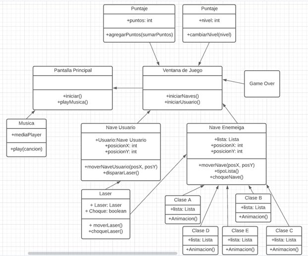

# Proyecto Programado 1 Space Invaders
## Desarrolladores:
- [Daniel Serrano Cañas](https://github.com/dansecan25) 
- [Sebastian Hidalgo Vargas](https://github.com/Katharsis0)
- [Daniel Andres Zuñiga Barahona](https://github.com/danyazunigab)
- [Adriana María Calderón Barboza](https://github.com/cuadriante) 

## Jira
[Link a Jira](https://projprog1spaceinvaders.atlassian.net/jira/software/projects/SPAC/boards/1)

## GitHub del Proyecto Programado
[Link al proyecto](https://github.com/dansecan25/Proyecto1-SpaceInvaders)

## Plan de Iteraciones

## User Story

## Asignación de Tareas
- Sebastían:
  - Lista Doblemente Enlazada
  - Pantalla Game Over
  - Pantalla Ajustes
  - Clase Basic
  
- Adriana:
  - Diseños:
    - Pantalla Ajustes
    - Imagenes Enemigos
    - Fondos
    - Imagenes Boss colaboración con Sebastian
    - Imagenes Nave Jugador
    - Botones
    - Laser
    - Ventana de Juego
  - Hilera E y animación de la rotación
  - Gradle
  - Música
  - Nave Usuario
  - Laser

- Daniel Serrano:
  - Hilera B
  - Niveles
  - Botones(funcionalidad)
  - Puntos
  - Lista Circular
  - Ventana Principal
  - Ventana de Juego
  - Hilera C
  - Cambio aleatorio de clase

- Daniel Zúñiga:
  - Hilera D
  - Animaciones
  - Clase Boss
  - Nave Enemiga

## Bugs Encontrados

# Diseño
## Diagrama de Clases Inicial

